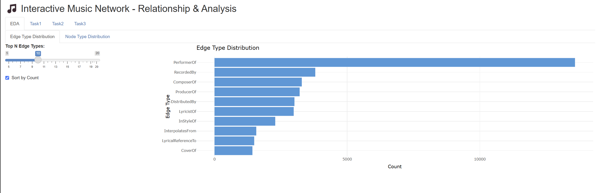
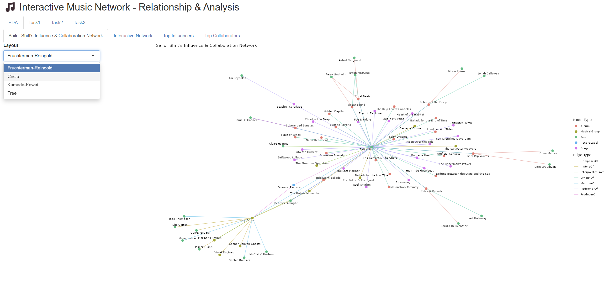
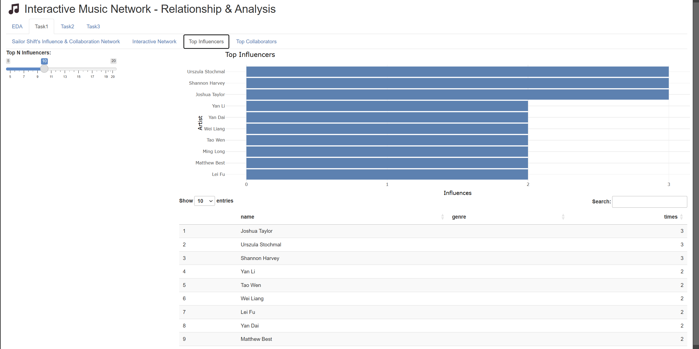
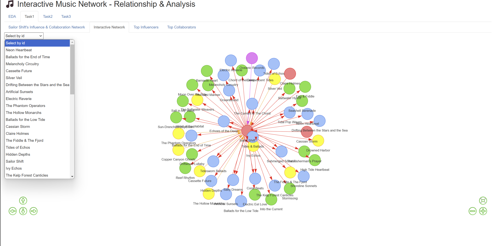
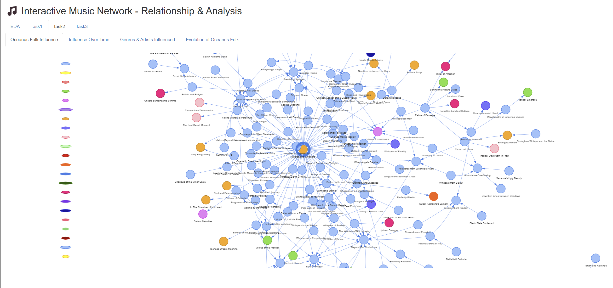
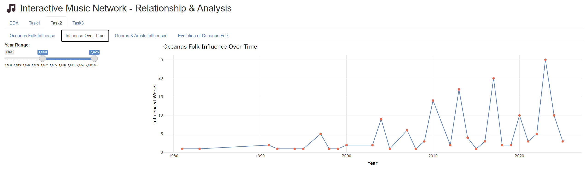

# **1 Introduction**

In the evolving landscape of Oceanus Folk music, understanding how artists influence each other and shape the genre over time is both complex and essential. This storyboard is designed as a visual and narrative guide through our Shiny dashboard prototype, which supports journalist Silas Reed’s investigation into the career trajectory of Sailor Shift and the broader impact of Oceanus Folk.

Drawing on Silas’s collected data about artists, genres, albums, and collaborations, the dashboard bridges the gap between data-driven research and interactive user experience. It allows users to explore how Sailor Shift’s career evolved, how her collaborations contributed to the genre’s international growth, and how influence patterns emerged within the music community.

The purpose of this storyboard is twofold:

-   **To illustrate** how thoughtfully designed UI components, interactive filters, and analytical features enable users to investigate collaboration networks and uncover musical influence patterns.

-   **To demonstrate** how our Shiny dashboard empowers users to manipulate, visualize, and interpret complex relational data—supporting both in-depth analysis and intuitive exploration.

The dashboard is structured around three core analytical perspectives:

-   **Influence Overview:** Exploring how Sailor Shift’s artistic influences and collaborations have evolved throughout her career.
-   **Genre and Community Impact:** Visualizing how Oceanus Folk music’s influence has spread and transformed within the music industry, and examining how Sailor Shift’s rise has interacted with broader genre trends and top artists.
-   **Rising Star Profiling:** Developing profiles of emerging artists, comparing career trajectories, and predicting the next generation of Oceanus Folk stars using data-driven visualizations.

Each storyboard section includes UI screenshots, explanations of interactive elements and filters, and interpretation panels to guide users in drawing actionable insights from the visualizations.

# **2 Preparation**

## 2.1 Data Preparation

*Reference:* [Take-home_Ex02](https://isss608-25t3-anqi.netlify.app/take-home_ex/take-home_ex02/take-home_ex02)  : **Data Import & Processing**

## 2.2 **Methodology**

This project builds on a structured knowledge graph of the Oceanus Folk music community, using the following main methods:

-   **Data Cleaning and Modeling**\
    Method: Import, clean, and standardize data to ensure consistency and usability for network analysis.\
    Tools: `tidyverse`, `janitor`, `jsonlite`

-   **Network Construction and Analysis**\
    Method: Build networks of people, works, and groups, and calculate centrality metrics (e.g., PageRank) to identify key figures.\
    Tools: `tidygraph`, `igraph`

-   **Network and Attribute Visualization**\
    Method: Visualize networks, bar charts, and heatmaps to illustrate collaborations, influence paths, and community structure.\
    Tools: `ggraph`, `ggplot2`

-   **Interactive Network Diagrams**\
    Method: Build interactive network visualizations with node filtering and dynamic exploration.\
    Tools: `visNetwork`, `shiny`

-   **Community and Collaboration Analysis**\
    Method: Apply community detection and clustering algorithms to analyze network structure and highlight Sailor Shift’s collaborators and influence.\
    Tools: `tidygraph`, `igraph`, clustering packages (e.g., `FactoMineR`, `factoextra`)

# **Section 1 – Exploratory Data Analysis**

In this section, users can intuitively explore the distribution of various **edge types** in the music network through visual charts, as well as the distribution of **node types** (accessible via the tab switch).\


The bar chart above displays the frequency of different edge types (such as PerformerOf, ComposerOf, RecordedBy, etc.) within the entire network. Users can quickly identify which types of relationships are most prevalent in the data—for example, "PerformerOf" edges occur far more frequently than others, indicating that performer-based connections dominate the network. Additionally, by switching to the "Node Type Distribution" tab, users can examine the distribution of different node types (e.g., artists, albums, genres).

**Interactive Features:**

-   A slider lets users select the number of top edge types (relationships) to display on the chart, making it easy to focus on the most common types or explore less frequent ones.

-   The “Sort by Count” checkbox allows users to quickly reorder the edge types from most to least common.

-   The horizontal bar chart dynamically updates based on user selections, showing the distribution and relative frequency of different edge types.

# **Section 2 – Influence Overview**

This section focuses on tracing the key sources of influence in Sailor Shift’s career, identifying who influenced her the most, who she collaborated with, and whom she subsequently influenced across the Oceanus Folk music community.

{fig-align="center"}

In the “Sailor Shift’s Influence & Collaboration Network” section, users can visually explore the intricate web of connections linking Sailor Shift to other artists, albums, musical groups, and songs. In this network graph, Sailor Shift is positioned as the central node, with various colored edges indicating different relationship types.\
The legend on the right helps users distinguish between node types (person, musical group, album, song) and edge types. Using this interactive network, users can quickly:

-   Identify Sailor Shift’s direct connections to people, groups, and works;

-   Understand her central role and the pathways through which her influence spreads within the community;

-   Observe the diversity and structure of collaboration and influence types.

This visualization serves as an intuitive gateway for users to investigate Sailor Shift’s professional network, uncover key collaborators and works, and appreciate her unique position in the Oceanus Folk music scene.

Users can also switch between the “Top Influencers” and “Top Collaborators” tabs at the top to view, respectively, the artists who have most influenced Sailor Shift and those who have most frequently collaborated with her.

{fig-align="center"}

**Interactive Features:**

-   The “Top N Influencers” slider allows users to dynamically select how many top influencers to display; both the bar chart and the table below update simultaneously, helping users focus on the most impactful influencers or explore a broader list.

-   The influencer table is linked to the slider, adjusting in real time to show the selected artists, their genres, and influence counts, supporting quantitative analysis of the influence structure.

-   The search box on the right lets users instantly locate and filter specific artists or entries in the list, enhancing lookup efficiency.

-   The bar chart and data table are synchronized, providing users with both an intuitive visual overview and detailed information at a glance.

**Network Graph Interactive Features:**

{fig-align="center"}

-   A dropdown menu allows users to select any artist, band, album, or song as the focal point of the network graph.

-   The interactive network visualization dynamically updates to highlight all direct and indirect relationships—such as influence, collaboration, or stylistic connections—centered around the selected node.

-   Node and edge colors clearly distinguish different types (e.g., Person, Musical Group, Album, Song), while arrows indicate the direction of influence or collaboration.

-   Navigation controls (zoom, pan, reset) enable users to explore large or dense networks with ease.

# **Section 3 – Genre and Community Impact**

This section focuses on how the Oceanus Folk genre has influenced and shaped the broader music community over time.

{fig-align="center"}

**Interactive Features:**

-   Users can select any song, artist, or genre from the dropdown menu on the left to view its influence and connection network within the Oceanus Folk community.

-   The interactive network graph visually maps out how Oceanus Folk’s influence has spread, showing both direct and indirect relationships between genres, artists, and songs.

-   Node colors represent different entity types (e.g., genre, artist, song, album), helping users quickly distinguish the structure and composition of the community.

-   Edge directions indicate the flow of influence—who is influencing whom—enabling users to trace the pathways through which Oceanus Folk impacts the broader music network.

-   The visualization supports zooming, panning, and resetting for easy navigation through complex or densely connected sub-networks.

**Users also can switch to the “Oceanus Folk Influence Over Time” tab at the top to examine the historical evolution of the genre’s influence:**

{fig-align="left"}

**Interactive Features:**

-   The year range slider on the left lets users customize the time window, enabling focus on specific periods of interest.

-   The line chart dynamically updates to show how the number of works influenced by Oceanus Folk changes year by year, making it easy to observe growth patterns, fluctuations, or surges in influence.

-   With these interactive tools, users can analyze long-term trends, key turning points, and the overall diffusion pace of Oceanus Folk’s impact within and beyond the music community.

**The “Oceanus Folk Influence Over Time” tab offers similar interactive features, enabling users to track the annual count of new or active works classified under Oceanus Folk.**

# **Section 4 – Rising Star Profiling**

This section is mainly composed of two parts.

**1. Career Comparison for Three Artists (Rise in Popularity & Influence)**

**Faceted Line Charts**

-   Each artist is represented by a separate line/color; the x-axis is the year, and the y-axis is the popularity or influence score.

-   Subplots can separately show metrics such as: number of works released, number of collaborations, notable chart placements/awards, and influence spread (e.g., works sampled or collaborations).

-   **Purpose:** Clearly compare the starting phase, breakout period, and sustained stages of the three artists, highlighting differences and similarities in their paths to stardom.

**Radar Chart (Spider Plot)**

-   The core features of each artist (popularity, collaborations, awards, influence, etc.) are normalized and displayed together in a single radar chart.

-   **Purpose:** Instantly visualize the comprehensive profile of each artist and identify the typical “rising star” patterns.

**Career Annotations**

-   Key milestones are annotated on the line charts, such as first chart entry, breakout growth, or significant influence jumps.

-   **Purpose:** Help viewers easily understand which events or turning points played a crucial role in each artist’s rise to stardom.

-   This visualizations support **interactive time linking**, enabling a comprehensive temporal analysis experience.

**In all three visualizations above, users can choose the artists thry interested and compare with other artists.**

**2. Prediction of Rising Stars**

This part predict the most promising “rising stars” for the next five years (e.g., 2025–2030). The key analytical and interactive elements are as follows:

-   **Predicted Future Stars Table**

    -   Displays the Top 3 or Top 5 artists with the highest predicted influence scores for each selected year, using a table.

    -   Key information includes artist name and predicted score, helping users quickly identify the most promising future stars for any given year.

-   **Bubble Plot**

```         
-    The x-axis represents growth rate, the y-axis represents current influence, and bubble size corresponds to predicted future potential.

-    This visualization intuitively highlights artists in the “high-growth, high-potential” area—combining both current standing and future trajectory.
```

-   **Interactive Features:**

-   **Year Selection (Slider/Dropdown)**

```         
-    Users can select any target year within the forecast period. The leaderboard and bubble plot will update in real time to reflect the predicted rising stars for the chosen year, making it easy to compare changes over time.
```

-   **Trend Animation**

-   An autoplay feature enables the leaderboard and bubble plot to advance automatically through each year, dynamically visualizing the emergence and turnover of rising stars.

By combining rich visualizations with temporal interactivity, this module enables users to clearly identify, track, and compare the most promising artists and their trajectories over the next five years.
